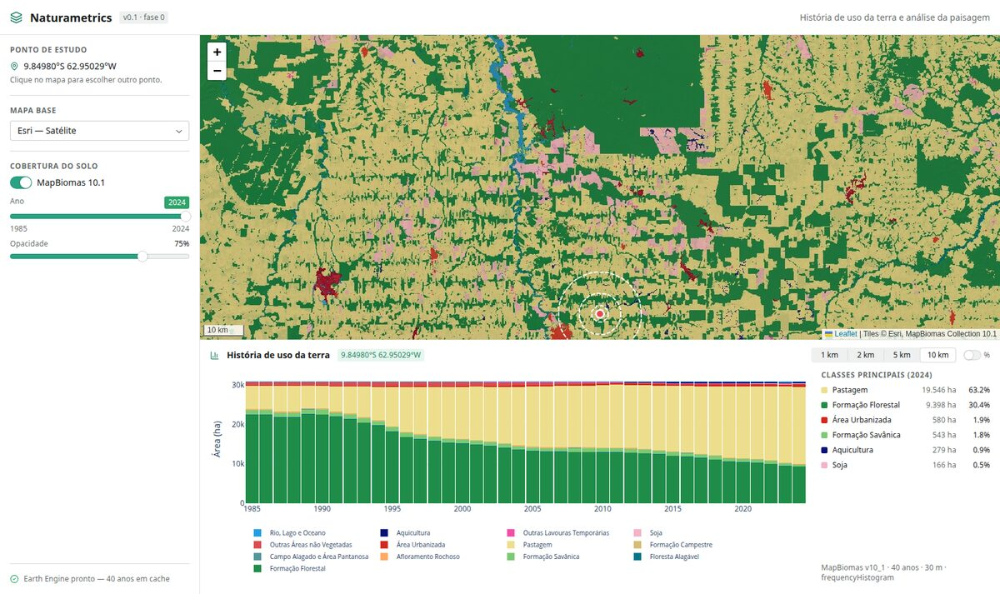

# Naturametrics

**Land-use history and landscape analysis for Brazil.**

Click anywhere on a map of Brazil — or pick a National Forest Inventory sampling point —
and get the full MapBiomas land-cover trajectory (1985–2024) for concentric buffers around
that location, an estimate of how old the surrounding forest and natural vegetation is,
and satellite context imagery from Google Earth Engine.



Naturametrics is a sibling of [Yvynation](https://github.com/leandromet), not a fork of
it: Yvynation monitors *protected and Indigenous territories*, which are known polygons;
Naturametrics studies *any location*, entered as a coordinate. They share engineering —
Earth Engine access patterns, tile caching, the Reflex state structure — not a product.

---

## Status

| Phase | | |
|---|---|---|
| 0 | Foundations — map, Earth Engine, layer machinery | ✅ complete |
| 1 | Click → buffers → MapBiomas history chart | ✅ core loop working |
| 2 | Year control, interactive legend, chart↔map linkage | 🚧 in progress |
| 3 | Vegetation age (MapBiomas + Hansen) | planned |
| 4 | Satellite context (Sentinel-2, Landsat, MODIS, SPOT 2008) | planned |
| 5 | IFN sampling points | planned |
| 6 | Export + provenance | planned |

Full plan in [`doc/03-roadmap.md`](doc/03-roadmap.md).

---

## Quick start

Requires **Python 3.12**, **Node ≥ 18**, and Earth Engine access to the
`ee-leandromet` project.

```bash
git clone <this-repo> naturametrics
cd naturametrics

python3 -m venv .venv
source .venv/bin/activate
pip install -U pip
pip install -r requirements.txt

cp .env.example .env        # then edit — see "Configuration" below

reflex run                  # first run installs the frontend toolchain (a few minutes)
```

Then open **http://localhost:3010**.

> The **first** `reflex run` downloads and compiles the frontend toolchain, which takes a
> few minutes. Subsequent starts take seconds.

### Earth Engine authentication

Locally the simplest path is Application Default Credentials:

```bash
earthengine authenticate          # once; writes ~/.config/earthengine/credentials
export GCP_PROJECT_ID=ee-leandromet
```

`services/ee_client.py` tries three sources in order — an env-var service account
(the deployment path), ADC (local), then a service-account JSON file. If none work it
fails loudly at startup rather than silently serving a map with no data.

---

## Configuration

All settings are environment variables with working defaults; put them in `.env`.

| Variable | Default | Purpose |
|---|---|---|
| `GCP_PROJECT_ID` | `ee-leandromet` | Earth Engine project. **The Partner-tier grant is attached to this project** — a different one silently drops to contributor limits. |
| `NM_EE_TIER` | `partner` | `partner` \| `contributor`. Sizes the request pool. |
| `NM_EE_CONCURRENCY` | `64` | Simultaneous Earth Engine requests. |
| `NM_BASEMAP` | `esri_imagery` | `esri_imagery`, `esri_topo`, `osm`, `google_maps`, `google_satellite`, `google_hybrid`, `google_terrain` |
| `NM_SPOT_ENABLED` | `false` | SPOT 2008 layers — licence-gated, see below. |
| `NM_HANSEN_TREECOVER_THRESHOLD` | `30` | Tree-cover % defining Hansen forest. |
| `NM_IFN_CATALOG` | `data/ifn_points.csv` | Derived IFN point catalogue. |
| `PORT` / `BACKEND_PORT` | `3010` / `8011` | Frontend / backend ports. |

---

## Commands

```bash
reflex run                   # dev server with hot reload
reflex run --env prod        # production build locally
pytest -m "not ee"           # fast tests (no network)
pytest -m ee                 # tests that hit the live Earth Engine API
pytest                       # everything

# Offline data preparation (never run by the app itself)
python scripts/fetch_ifn.py --list
python scripts/fetch_ifn.py --all --build-catalog
```

---

## How it works

```
click on map
   │  Leaflet → Reflex event (lat, lon)
   ▼
services/geo.py          validate: in Brazil? lat/lon swapped?
   ▼
services/buffers.py      1/2/5/10 km discs — drawn locally, instantly
   ▼
services/mapbiomas_history.py
   │  ONE reduceRegions over 4 buffers × 40 year-bands
   ▼
Plotly stacked columns + summary + provenance
```

Two design choices carry most of the weight:

**One persistent map, never rebuilt.** Layers are diffed in place by
[`components/map/leaflet_map.js`](naturametrics/components/map/leaflet_map.js), so
changing the MapBiomas year never moves the viewport. Tile URLs for all 40 years are
minted concurrently at startup (~1.4 s), which makes the year slider a dictionary lookup.

**Batch what is one query; fan out everything else.** MapBiomas ships 40 years as 40
bands of one image, so the whole 40 × 4 matrix is a single round-trip (~1.8 s) instead of
160 sequential ones. Everything independent goes out concurrently on a 64-worker pool.
The Partner tier makes Earth Engine compute effectively free here; wall-clock latency is
the only budget that matters.

---

## Repository layout

```
naturametrics/
├─ naturametrics/          the Reflex application
│  ├─ config/              dataset IDs, MapBiomas legend, settings
│  ├─ services/            Earth Engine, geometry, analysis  (no UI)
│  ├─ state/               AppState, composed from mixins
│  ├─ components/          map, charts, panels
│  └─ pages/               routes
├─ scripts/fetch_ifn.py    offline IFN data preparation
├─ data/                   ifn_points.csv committed; raw/ and cache/ gitignored
├─ tests/
└─ doc/                    premises, architecture, roadmap, methodology
```

Start with [`doc/README.md`](doc/README.md).

---

## Data sources & licences

| Source | Licence |
|---|---|
| **MapBiomas** Collection 10.1 (LULC, Deforestation & Secondary Vegetation, Fire) | CC-BY-SA — *MapBiomas Project* |
| **Hansen Global Forest Change** | CC-BY 4.0 — Hansen et al. (2013) *Science* 342:850–853 |
| **IFN** (Inventário Florestal Nacional) | CC-BY — *Serviço Florestal Brasileiro* |
| **Sentinel-2** | Copernicus / ESA |
| **Landsat**, **MODIS** | USGS / NASA |
| **SPOT — Brazil Forest Imagery 2008** | ⚠️ **Restricted** — requires accepting Google's licence agreement, granted to the service account. Disabled by default (`NM_SPOT_ENABLED=false`). |
| Basemaps | Esri, OpenStreetMap, Google |

Details and caveats in [`doc/04-data-sources.md`](doc/04-data-sources.md).

⚠️ The Google `mt1.google.com` tile endpoints are not a licensed public API. They are
available but not the default; before a public deployment use a Google Maps Platform key
or stay on Esri/OSM.

---

## Deployment

Target is **Cloud Run**, continuously deployed from `main`, pointed at the same
`ee-leandromet` Earth Engine project. Cloud Run has no ADC file, so the container
authenticates with `EE_PRIVATE_KEY` + `EE_SERVICE_ACCOUNT_EMAIL` from Secret Manager, and
binds `PORT` (frontend) and `BACKEND_PORT` (backend) separately. See **D10** in
[`doc/09-open-decisions.md`](doc/09-open-decisions.md).

---

## Troubleshooting

**Grey map, and the browser console shows `can't establish a connection to
ws://localhost:8011/_event/`.** The backend worker has died — the frontend still serves,
so it looks like a rendering problem rather than a crash. Check the terminal for
`Unexpected exit from worker`. The usual cause is a Reflex event-handler signature that
does not match what a component's trigger emits; `pytest tests/test_app_builds.py`
catches that class of error before it reaches the server.

**`Address already in use`.** Another process holds 3010 or 8011. Set `PORT` /
`BACKEND_PORT`, or find the holder with `ss -tlnp | grep 8011`.

**`React is not defined` in the browser.** Custom JS injected into a Reflex page must use
the bare hook names (`useEffect`, `useRef`), not the `React.*` namespace, and must declare
them in the component's `add_imports`.

---

## Licence

See [LICENSE](LICENSE).
